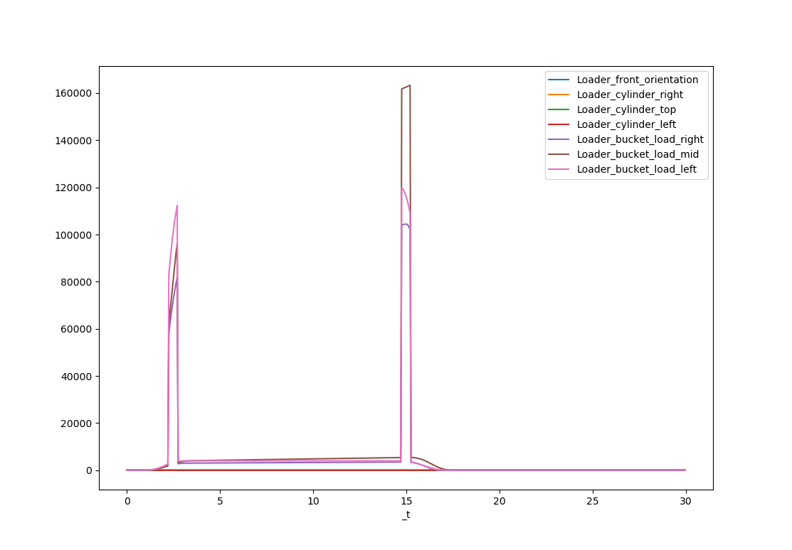
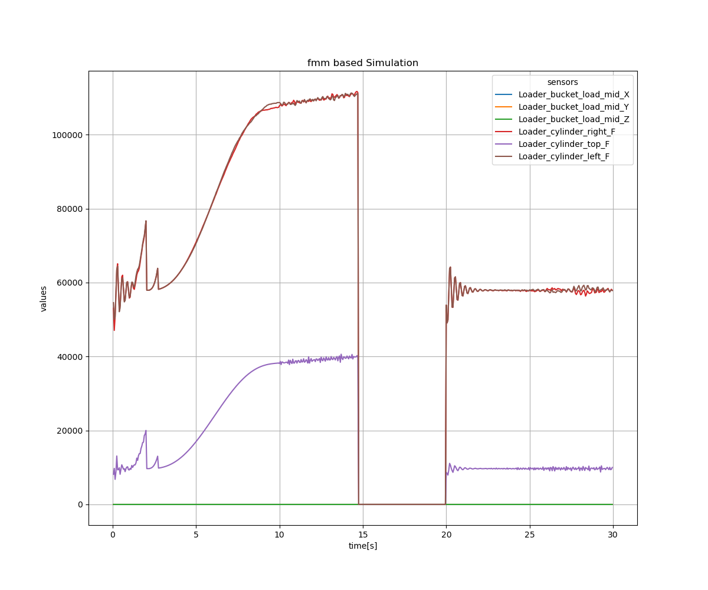

<!---
  SPDX-FileCopyrightText: 2023 SAP SE

  SPDX-License-Identifier: Apache-2.0

  This file is part of FEDEM - https://openfedem.org
--->

# Test for divergence handling facility

The script [test_divergence.py](test_divergence.py) in this folder
is set up to test the divergence handling capabilities in fedempy.
The loader model will be used for testing,
while reusing the FE Parts from the [models](../models) folder.
The input data are stored in the file `loader_01_input.csv`,
which have been modified to provoke convergence failures during the simulation.
The modified input is shown in the picture below:

Two extraordinary peaks are created at 2.5 sec and 15 sec with a duration of +/-0.25 sec,
totally 0.5 sec. The peaks are created by multiplying the original data by factor 30.

The simulation itself is built up on 3 window segments, each 10 sec long (200 steps)
with a timestep of 0.05 sec. The peaks (discontinuities) are located in the first and
second segment to provoke the failure.
The anticipated simulation results are shown in the figure below:

The first segment shows the error handling at 2.5 sec, divergence occurs,
the load will be scaled down (s-scale shape) the analysis continues to the
end of the segment in quasi-static mode (smooth curve).
The second segment starts with the dynamics settings until the divergence
occurs, the jump over facility will be activated to jump to the window's end.
The third segment starts with a reinitialsation and the analysis runs in dynamic
mode to the end of the window.
